# 🚀 Navigation Autonome par Imitation Learning

[](https://docs.ros.org/en/humble/)
[](https://classic.gazebosim.org/)
[](https://pytorch.org/)
[](https://www.python.org/)

---

## 📖 Présentation du projet

Ce projet implémente un système de **navigation autonome** pour un robot **iRobot Create 3** en utilisant l'**Apprentissage par Imitation (Imitation Learning)**.

Le robot apprend à naviguer dans un environnement simulé sous **ROS 2** et **Gazebo** en observant des démonstrations humaines, puis en les améliorant via un processus itératif.

### 🎯 Objectifs du projet

1. ✅ Apprendre une politique de navigation à partir de démonstrations humaines
2. ✅ Naviguer de manière autonome dans un environnement en L avec obstacles
3. ✅ Atteindre l'objectif avec 100% de réussite
4. ✅ Comparer Behavioral Cloning seul vs BC enrichi par HG-DAgger

### ✨ Fonctionnalités principales

- ✅ **Behavioral Cloning** : Apprentissage supervisé à partir de démonstrations par téléopération
- ✅ **Human-Gated DAgger** : Affinement itératif par corrections humaines ciblées
- ✅ **Filtre de sécurité réactif** : Évitement d'obstacles en temps réel
- ✅ **Évaluation quantitative** : Métriques de performance (taux de réussite, temps, longueur de trajectoire)

---

## 🤖 Robot utilisé

<div align="center">
  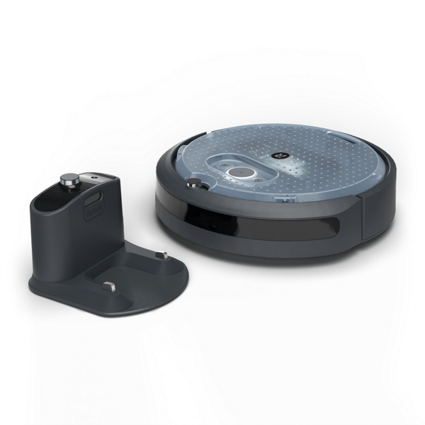
</div>

### Caractéristiques du robot

| Caractéristique | Description |
|-----------------|-------------|
| **Nom** | iRobot Create 3 |
| **Type** | Base mobile à deux roues différentielles |
| **Capteurs** | LiDAR, odométrie, bumper |
| **Communication** | ROS 2 |
| **Simulateur** | Gazebo Classic 11 |

---

## 📸 Aperçu de la simulation

<div align="center">
  <table>
    <tr>
      <td>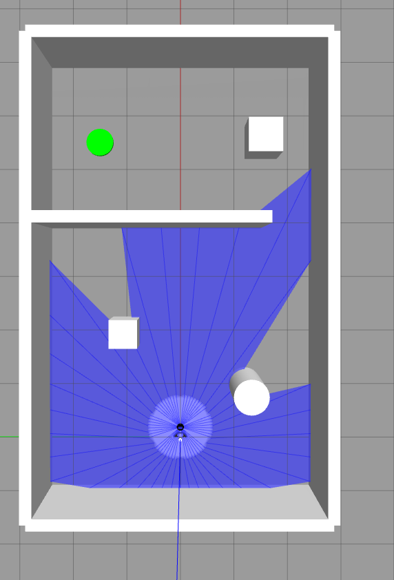</td>
      <td>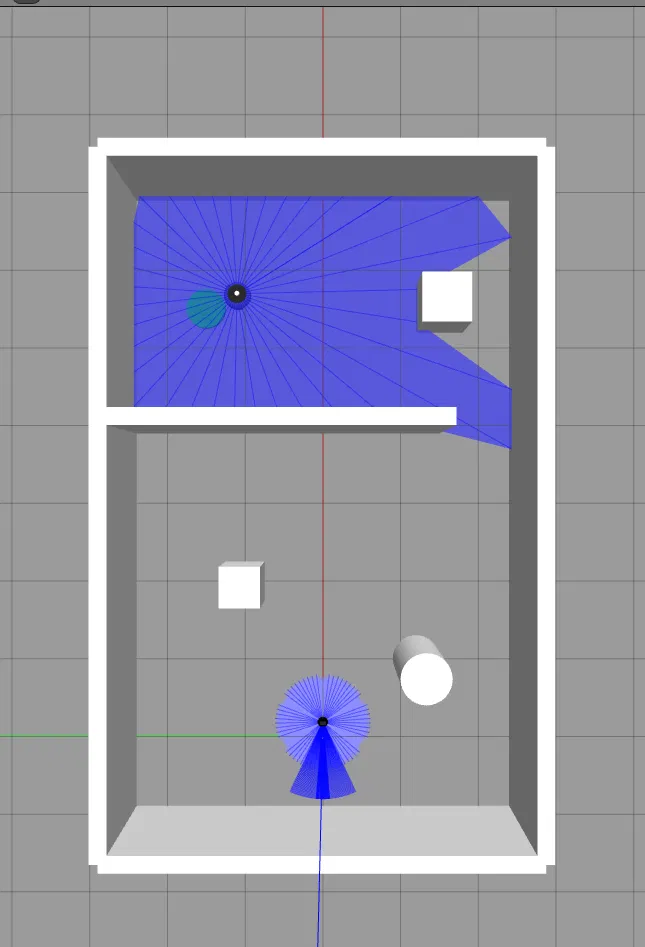</td>
    </tr>
    <tr>
      <td align="center"><b>📌 Position de départ</b></td>
      <td align="center"><b>🎯 Objectif atteint</b></td>
    </tr>
  </table>
</div>

---

## 🏗️ Architecture du système

### Pipeline global

┌──────────────────────────────────────────────────────────────────────┐
│ Simulation Gazebo │
│ ┌──────────────┐ ┌──────────────┐ ┌─────────────────────────┐ │
│ │ Robot │ │ LiDAR │ │ Objectif │ │
│ │ Create 3 │──▶│ Scan │──▶│ Position │ │
│ └──────────────┘ └──────────────┘ └─────────────────────────┘ │
└──────────────────────────────┬─────────────────────────────────────┘
│ ROS 2 Topics (/scan, /odom)
▼
┌──────────────────────────────────────────────────────────────────────┐
│ Observation (40D) │
│ ┌─────────────────────────────────────────────────────────────┐ │
│ │ 36x LiDAR + Distance Goal + Angle Goal + Vitesse │ │
│ └─────────────────────────────────────────────────────────────┘ │
└──────────────────────────────┬─────────────────────────────────────┘
│
▼
┌──────────────────────────────────────────────────────────────────────┐
│ Policy Network (MLP) │
│ ┌──────────┐ ┌──────────┐ ┌──────────┐ ┌──────────────────┐ │
│ │ Input │──▶│ Hidden │──▶│ Hidden │──▶│ Out │ │
│ │ (40) │ │ (256) │ │ (128) │ │ (2) │ │
│ └──────────┘ └──────────┘ └──────────┘ └──────────────────┘ │
└──────────────────────────────┬─────────────────────────────────────┘
│
▼
┌──────────────────────────────────────────────────────────────────────┐
│ Filtre de Sécurité │
│ ┌─────────────────────────────────────────────────────────────┐ │
│ │ Détection dans le cône frontal + Évitement │ │
│ └─────────────────────────────────────────────────────────────┘ │
└──────────────────────────────┬─────────────────────────────────────┘
│
▼
┌──────────────────────────────────────────────────────────────────────┐
│ Commandes de vitesse [v, ω] │
│ ┌─────────────────────────────────────────────────────────────┐ │
│ │ /cmd_vel → Robot Create 3 │ │
│ └─────────────────────────────────────────────────────────────┘ │
└──────────────────────────────────────────────────────────────────────┘


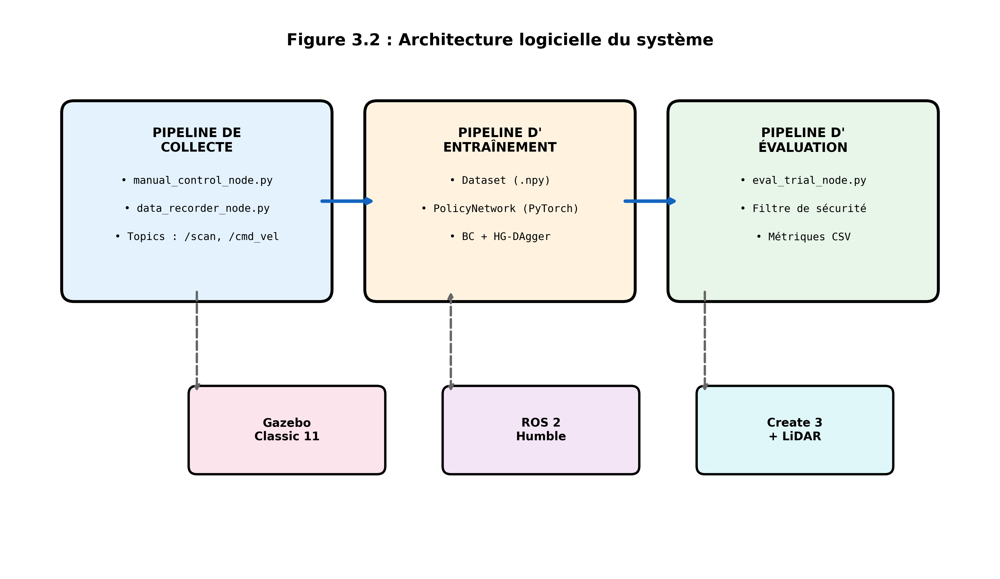

### 🧠 Architecture du réseau de neurones

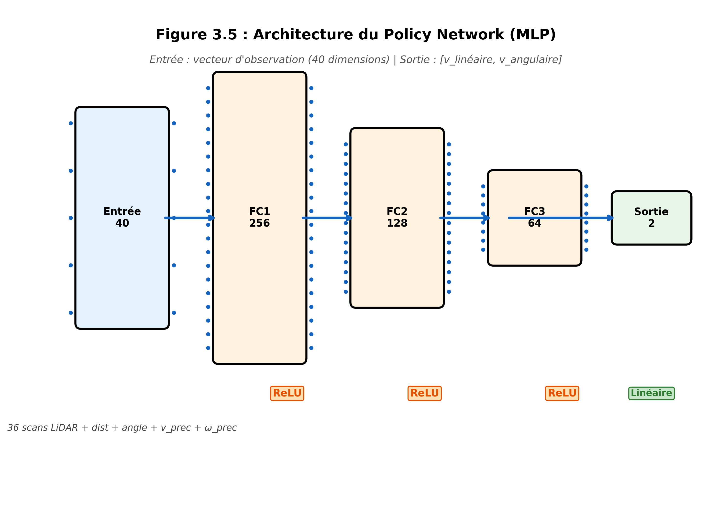

*Policy Network : MLP à 4 couches (40 → 256 → 128 → 64 → 2)*

### 📊 Prétraitement LiDAR

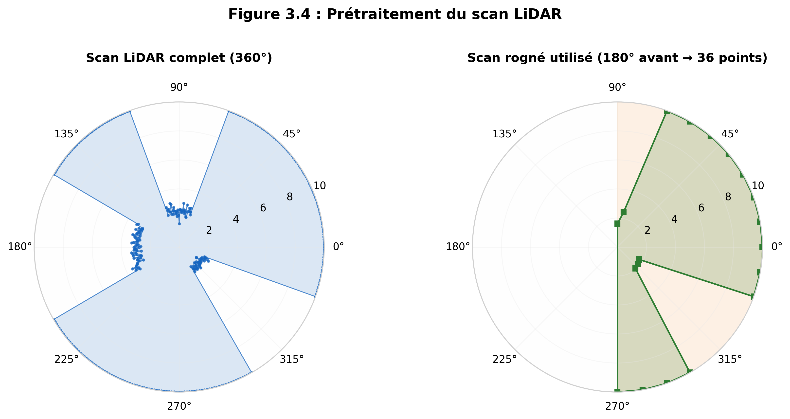

*Passage du scan complet (360°) au scan rogné utilisé (180° avant, 36 points)*

### 🛡️ Filtre de sécurité

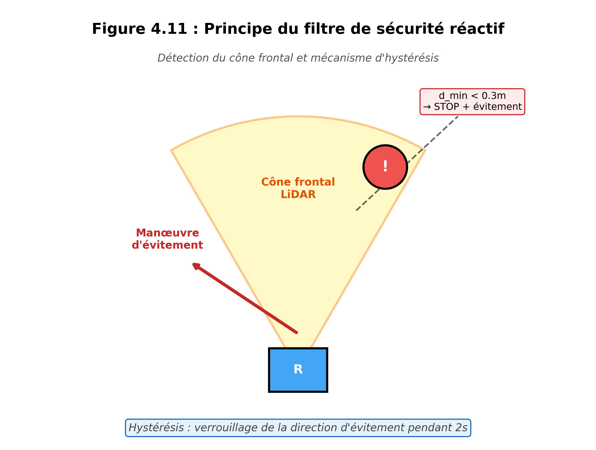

*Détection dans le cône frontal et manœuvre d'évitement avec hystérésis*

---

## 📈 Résultats

### 🏆 Performances globales

| Métrique | Résultat |
|----------|----------|
| **Taux de réussite** | **100%** (10/10 essais) |
| **Temps moyen de trajet** | 58.8 secondes |
| **Longueur moyenne de trajectoire** | 9.85 mètres |
| **Meilleure erreur de validation** | 0.0324 |

### 📊 Comparaison des méthodes

| Méthode | Pas d'entraînement | Erreur de validation |
|---------|-------------------|---------------------|
| BC seul (Behavioral Cloning) | 6 004 | 0.0425 |
| BC + HG-DAgger | 15 978 | **0.0324** |

### 📉 Courbe d'apprentissage

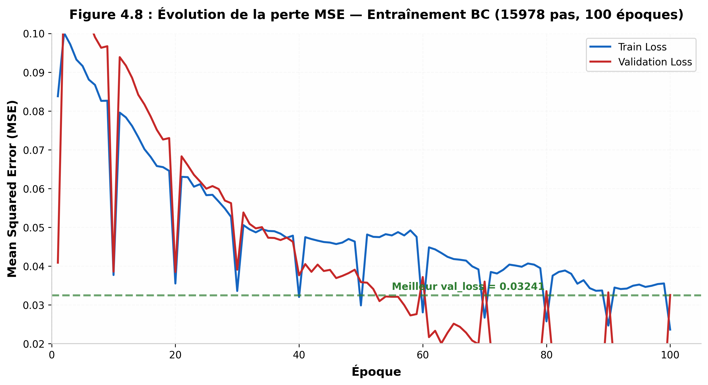

### 📊 Résultats d'évaluation

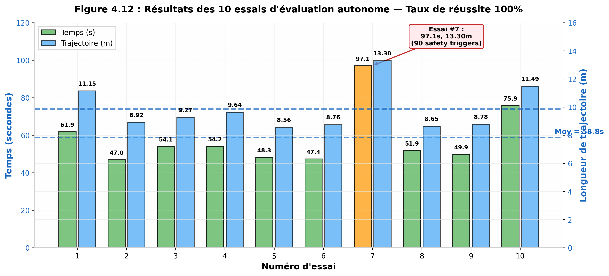

### 📊 Déclenchements du filtre de sécurité

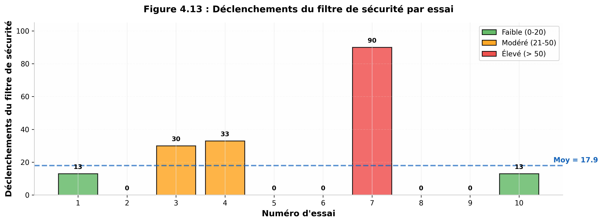

### 📊 Comparaison BC seul vs BC + HG-DAgger

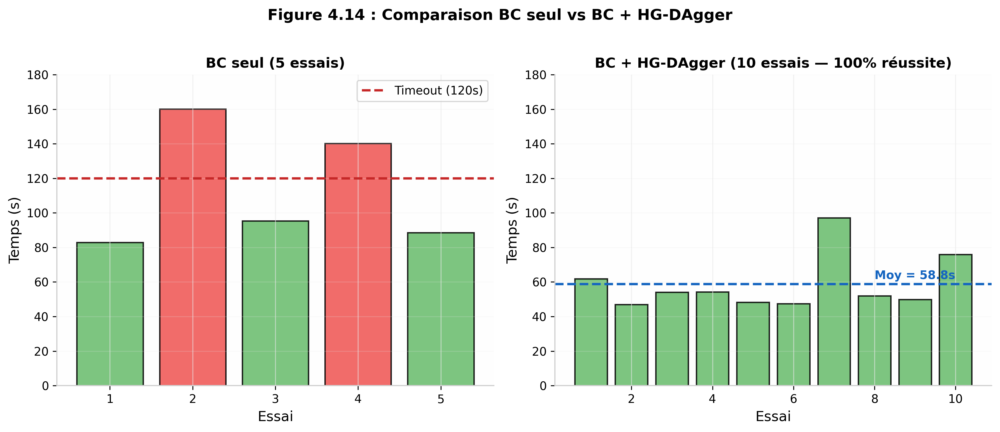

---

## 📋 Résultats détaillés des 10 essais

| Essai | Résultat | Temps (s) | Distance (m) | Contacts | Safety triggers |
|-------|----------|-----------|--------------|----------|-----------------|
| 1 | ✅ Réussi | 61.9 | 11.15 | Mineur | 13 |
| 2 | ✅ Réussi | 47.4 | 8.92 | Aucun | 0 |
| 3 | ✅ Réussi | 54.1 | 9.27 | Mineur | 30 |
| 4 | ✅ Réussi | 54.2 | 9.64 | Mineur | 33 |
| 5 | ✅ Réussi | 48.3 | 8.56 | Mineur | 0 |
| 6 | ✅ Réussi | 47.4 | 8.76 | Aucun | 0 |
| 7 | ✅ Réussi | 97.1 | 13.30 | Mineur | 90 |
| 8 | ✅ Réussi | 51.9 | 8.65 | Mineur | 0 |
| 9 | ✅ Réussi | 49.9 | 8.78 | Aucun | 0 |
| 10 | ✅ Réussi | 75.9 | 11.49 | Mineur | 13 |

**📊 Statistiques :**
- **Moyenne** : 58.8 s (±15.2) | **Médiane** : 9.85 m (±1.52)
- **Meilleur essai** : #2 (47.4 s, 8.92 m)
- **Essai le plus difficile** : #7 (97.1 s, 90 déclenchements)

---

## 🎬 Vidéo de démonstration

[](media/videos/demo_navigation.mp4)

*Cliquez sur l'image pour voir la vidéo de démonstration*

---

## 🏗️ Structure du projet
stage_imitation_learning/
├── data/ # Données d'entraînement (.npy)
├── docs/ # Rapport de stage (PDF)
├── models/ # Modèles PyTorch (.pth)
├── results/ # Résultats d'évaluation (CSV)
├── ros2_ws/ # Workspace ROS 2
├── scripts/ # Scripts utilitaires
├── media/ # Images et vidéos
│ ├── images/
│ └── videos/
├── src/ # Code source Python
│ ├── nodes/
│ ├── imitation_learning/
│ └── safety/
├── requirements.txt
├── README.md
└── .gitignore

---

## 🚀 Installation

### Prérequis

- Ubuntu 22.04 LTS
- ROS 2 Humble
- Gazebo Classic 11
- Python 3.8+
- PyTorch 1.10+

### Installation rapide

```bash
# 1. Cloner le dépôt
git clone https://github.com/qamarfrikha-a11y/imitation-learning-create3.git
cd stage_imitation_learning

# 2. Installer les dépendances Python
pip install -r requirements.txt

# 3. Compiler le workspace ROS 2
cd ros2_ws
colcon build
source install/setup.bash
