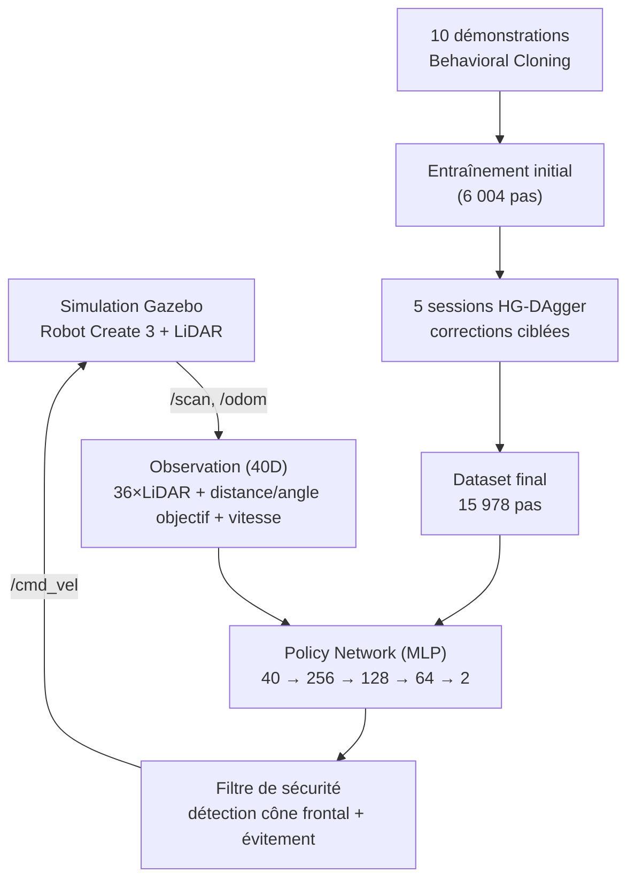

# 🚀 Navigation Autonome par Imitation Learning

[](https://docs.ros.org/en/humble/)
[](https://classic.gazebosim.org/)
[](https://pytorch.org/)
[](https://www.python.org/)

---

## 📖 Présentation du projet

Ce projet implémente un système de **navigation autonome** pour un robot **iRobot Create 3** en utilisant l'**Apprentissage par Imitation (Imitation Learning)**.

Le robot apprend à naviguer dans un environnement simulé sous **ROS 2** et **Gazebo**, à partir de **10 démonstrations initiales par Behavioral Cloning**, affinées ensuite par **5 sessions interactives de HG-DAgger**.


### 🎯 Objectifs

1. Apprendre une politique de navigation à partir de démonstrations humaines
2. Naviguer de manière autonome dans un couloir en L avec obstacles
3. Atteindre l'objectif avec 100% de réussite
4. Comparer Behavioral Cloning seul vs BC enrichi par HG-DAgger

---

## 🏗️ Pipeline global



---

## 📸 Simulation & résultats

<p align="center">
  
  
</p>

<p align="center"><b>📌 Position de départ</b> &nbsp;&nbsp;&nbsp;&nbsp;&nbsp;&nbsp; <b>🎯 Objectif atteint</b></p>

### 📉 Courbe d'apprentissage


### 📊 Comparaison BC seul vs BC + HG-DAgger


---

## 📈 Résultats

| Méthode | Essais | Taux de réussite | Pas d'entraînement | Erreur validation |
|---|---|---|---|---|
| BC seul (modèle instable + bug dataset) | 8 | 0% | 6 004 | 0.0425 |
| **BC + HG-DAgger (final)** | 10 | **100%** | 15 978 | **0.0324** |

**Temps moyen de trajet (version finale)** : 58.8 s (±15.2) — **Longueur moyenne** : 9.85 m (±1.52)

<details>
<summary>📋 Détail des 10 essais finaux</summary>

| Essai | Résultat | Temps (s) | Distance (m) | Contacts | Safety triggers |
|---|---|---|---|---|---|
| 1 | ✅ Réussi | 61.9 | 11.15 | Mineur | 13 |
| 2 | ✅ Réussi | 47.0 | 8.92 | Aucun | 0 |
| 3 | ✅ Réussi | 54.1 | 9.27 | Mineur | 30 |
| 4 | ✅ Réussi | 54.2 | 9.64 | Mineur | 33 |
| 5 | ✅ Réussi | 48.3 | 8.56 | Mineur | 0 |
| 6 | ✅ Réussi | 47.4 | 8.76 | Aucun | 0 |
| 7 | ✅ Réussi | 97.1 | 13.30 | Mineur | 90 |
| 8 | ✅ Réussi | 51.9 | 8.65 | Mineur | 0 |
| 9 | ✅ Réussi | 49.9 | 8.78 | Aucun | 0 |
| 10 | ✅ Réussi | 75.9 | 11.49 | Mineur | 13 |

</details>

---

## 🎬 Vidéo de démonstration


▶️ [**Voir la vidéo complète (47s)**](media/videos/demo_navigation.mp4)

---

## 🏗️ Structure du projet
---

## 🚀 Installation

**Prérequis** : Ubuntu 22.04, ROS 2 Humble, Gazebo Classic 11, Python 3.8+, PyTorch (CPU)

```bash
git clone https://github.com/qamarfrikha-a11y/imitation-learning-create3.git
cd imitation-learning-create3/ros2_ws
colcon build
source install/setup.bash
```

### Entraînement

```bash
python3 scripts/train_bc.py
```

### Évaluation

```bash
ros2 param set /motion_control safety_override full
python3 ros2_ws/src/create3_il/create3_il/eval_trial_node.py <trial_id>
```

---

## Remerciements

Structure de dépôt inspirée de [tomasvr/turtlebot3_drlnav](https://github.com/tomasvr/turtlebot3_drlnav).
